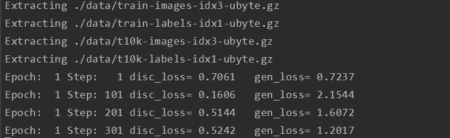

# GAN_Collections

## Overview

GAN (generative adversial networks) and some variants implementation.

### List of GAN and its variants:
* InfoGan: infomative GAN model.
* AeGan: auto-encoder GAN model.
* WGan-GP: Wasserstein GAN model with gradient peanlty. 
* LsGan: least-square GAN model.
* Gan-cls: LSGAN model with features and labels together in input of discriminator.

## Requirements

- [Python 3.5+](https://anaconda.org/anaconda/python)
- [TensorFlow 1.3.0+](https://www.tensorflow.org/install/)
 
## Usages

To train/infer/generate GAN models, you may need to run codes by following the steps in each model folder:
### Train GAN models
```
> python Train_Mnist.py 

```



### Infer (classification) a new sample in GAN models
```
> python Inference_Mnist.py
```

### Generate samples
```
> python Generate_Mnist.py
```

### Plot images
```
> python Plot.py
```
